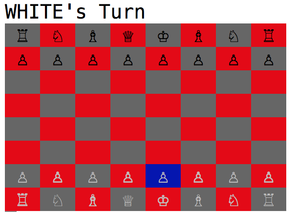

# Chess

A simple CLI based chess game built in Ruby



## Instructions

- Clone repository
- Run ```gem install colorize```
- Run ```ruby game.rb```

The cursor can be moved with the arrow keys. A piece to be moved and destination are both selected using the spacebar.
